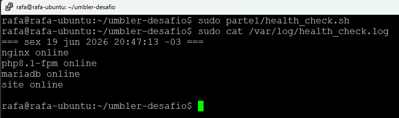

# Parte 1 - Linux e Resolução de Problemas

## Objetivo

Documentar a abordagem utilizada para diagnóstico de um erro HTTP 502 em ambiente Nginx + PHP-FPM e desenvolver um script simples para validação dos serviços.

## Arquivos Entregues

* `troubleshooting.md` – Respostas da análise de troubleshooting, comandos utilizados, possíveis causas do erro 502 e metodologia de diagnóstico.
* `health_check.sh` – Script para validação do status dos serviços Nginx e PHP-FPM com registro em log.
* `evidencias/01-servicos-ativos.png` – Validação dos serviços em execução.
* `evidencias/02-health-check-e-log.png` – Execução do script e registro das verificações em log.

## Evidências

### Serviços ativos

### Execução do health check

