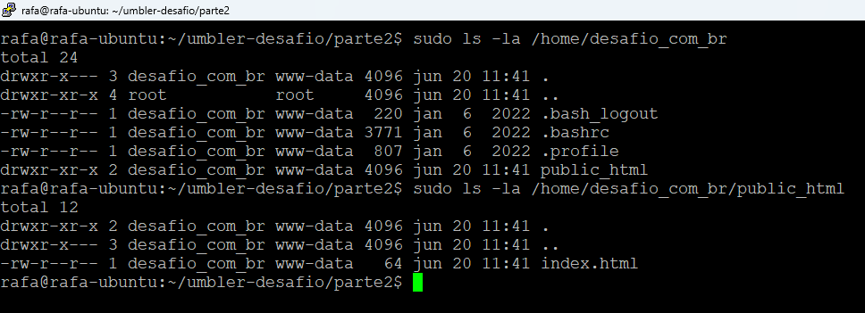
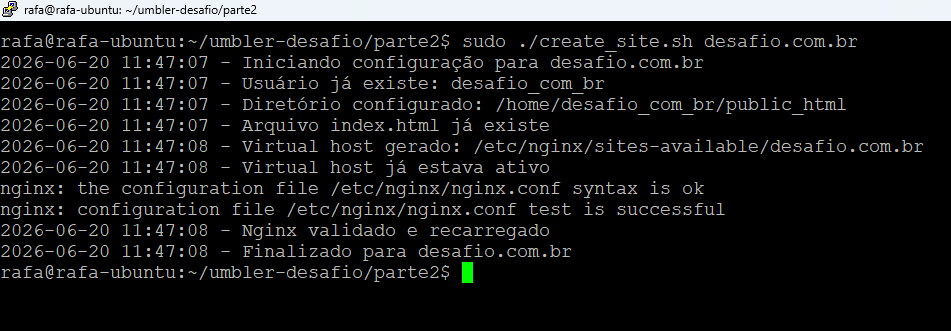
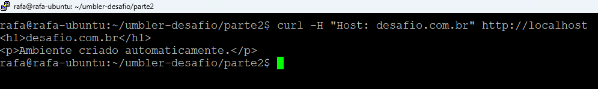
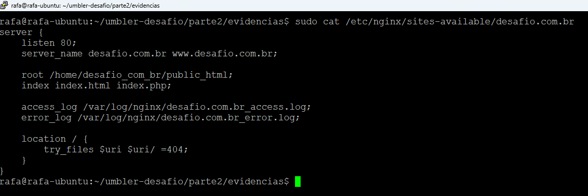

# Parte 2 - Automação com Shell Script

## Objetivo

Automatizar a criação de ambientes de hospedagem compartilhada.

O script realiza:

- Criação de usuário Linux derivado do domínio informado.
- Criação da estrutura `/home/<usuario>/public_html`.
- Geração de Virtual Host Nginx.
- Validação da configuração utilizando `nginx -t`.
- Reload do Nginx somente em caso de sucesso.
- Registro das ações em log.
- Execução idempotente.

## Execução

```bash
sudo ./create_site.sh desafio.com.br
```

## Evidências

### Estrutura criada



### Validação de idempotência



### Virtual Host respondendo



### Configuração gerada pelo script


