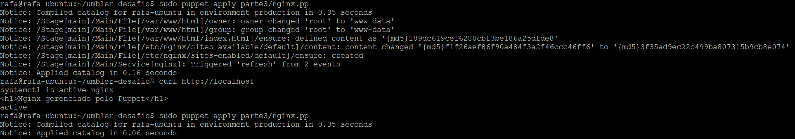
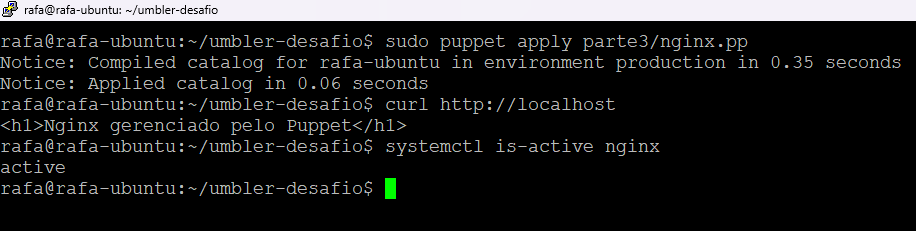

# Parte 3 - Gerenciamento de Configuração (Puppet)

## Objetivo

Demonstrar a utilização de configuração como código utilizando Puppet para garantir a instalação e configuração padronizada do Nginx.

## Arquivos Entregues

* `puppet.md` – Respostas conceituais sobre Puppet e idempotência.
* `nginx.pp` – Manifest utilizado para instalação e configuração do Nginx.
* `templates/default.conf.erb` – Template da configuração do Virtual Host.
* `evidencias/01-primeira-execucao.png` – Primeira execução do manifest.
* `evidencias/02-idempotencia-e-validacao.png` – Validação de idempotência e funcionamento do serviço.

## Implementação

Foi criado um manifest Puppet responsável por:

* Instalar o pacote Nginx.
* Garantir a existência da estrutura de diretórios.
* Gerenciar o arquivo index.html.
* Gerenciar a configuração padrão do Nginx através de template.
* Garantir que o serviço esteja habilitado e em execução.

## Evidências

### Primeira execução

### Idempotência e validação

